# Top 25 Best Global Discount Shopping Platforms in 2025 (Comprehensive Review)

Ever feel like regular retail prices are laughing at your wallet while you're just trying to look good and furnish your place without selling a kidney? Finding quality fashion, home decor, electronics, and lifestyle products at prices that don't make you question your life choices requires knowing where to shop smart. The best discount shopping platforms deliver trending styles, functional home goods, and gadget finds directly from manufacturers and warehouses, cutting out middlemen markup and passing genuine savings to you while maintaining acceptable quality standards.

## **[LightInTheBox](https://www.lightinthebox.com)**

Global online retailer bringing trendy fashion, home living, and lifestyle products directly from warehouses to customers in 200+ countries since 2007.

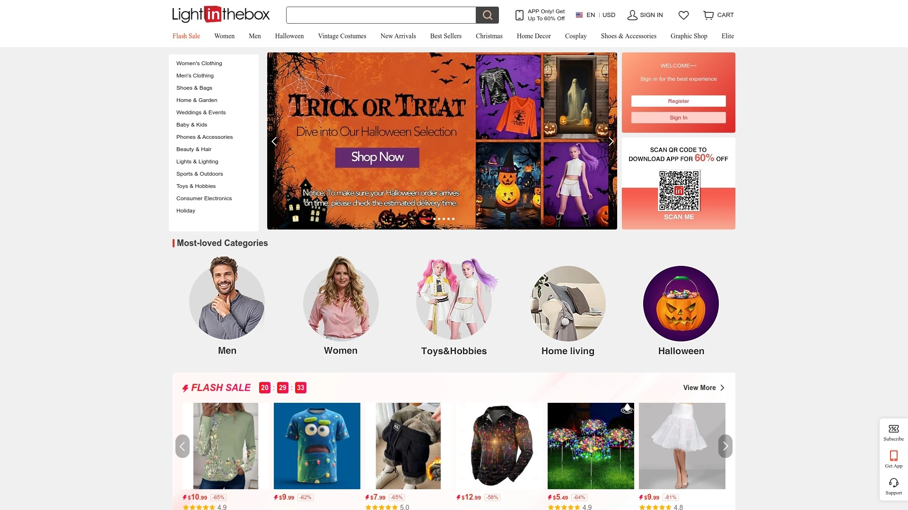

LightInTheBox operates as a direct-from-manufacturer platform, eliminating retail markup by shipping products straight from suppliers to customers worldwide. The platform adds over 1,000 new products daily across categories including women's, men's, and children's clothing, wedding attire, home decor, electronics, beauty products, and auto accessories. Customization options let shoppers personalize certain items like wedding dresses and decorations to exact specifications rather than settling for standard offerings. The mobile app enhances convenience with daily flash sales, check-in rewards, massive coupons, and push notifications for price drops and sale alerts. Shopping experience features include customer review communities, secure payment options with buy-now-pay-later availability, and product browsing organized by category, flash sales, new arrivals, and bestsellers. Delivery typically arrives within 3-20 business days depending on selected shipping speed, with orders trackable from warehouse to doorstep. The rewards program provides points equal to 1% of net purchase amounts on qualifying orders, stackable with frequent promotional discounts. LightInTheBox maintains GDPR compliance and secure checkout systems protecting customer data throughout transactions. Trustpilot ratings average 4.3 stars from 461,000+ verified reviews, with responsive customer service replying to 97% of negative reviews within 24 hours.

## **[AliExpress](https://www.aliexpress.com)**

China-based global marketplace connecting millions of sellers with buyers worldwide, offering unbeatable variety across every imaginable product category.

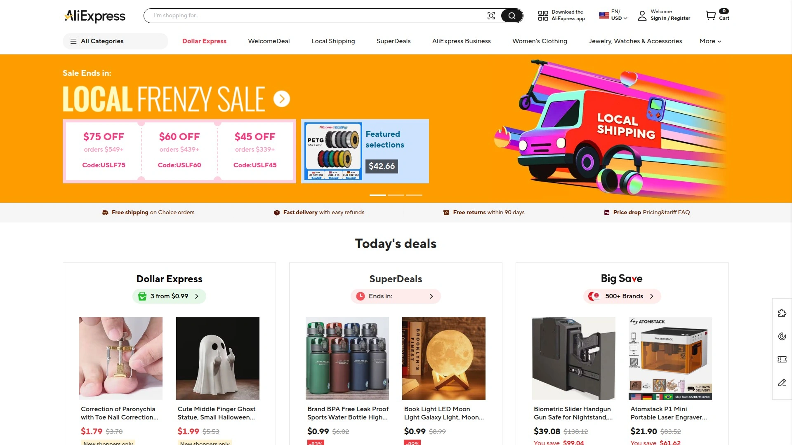

AliExpress functions as a platform marketplace rather than direct seller, hosting thousands of merchants competing on price and quality. The massive selection spans electronics, fashion, home goods, beauty, toys, sports equipment, and virtually anything else you can think of, often at prices lower than anywhere else online. Buyer protection policies safeguard purchases with dispute resolution systems and money-back guarantees if items don't arrive or match descriptions. Global shipping with tracking makes international orders manageable, though delivery times typically range 15-45 days depending on seller location and shipping method chosen. The platform excels for finding niche items, bulk purchases, and products where brand names matter less than functionality. Reviews and seller ratings help identify trustworthy merchants worth buying from repeatedly.

## **[Shein](https://www.shein.com)**

Fast-fashion powerhouse dominating affordable trendy clothing with new styles dropping daily at prices that seem almost impossible.

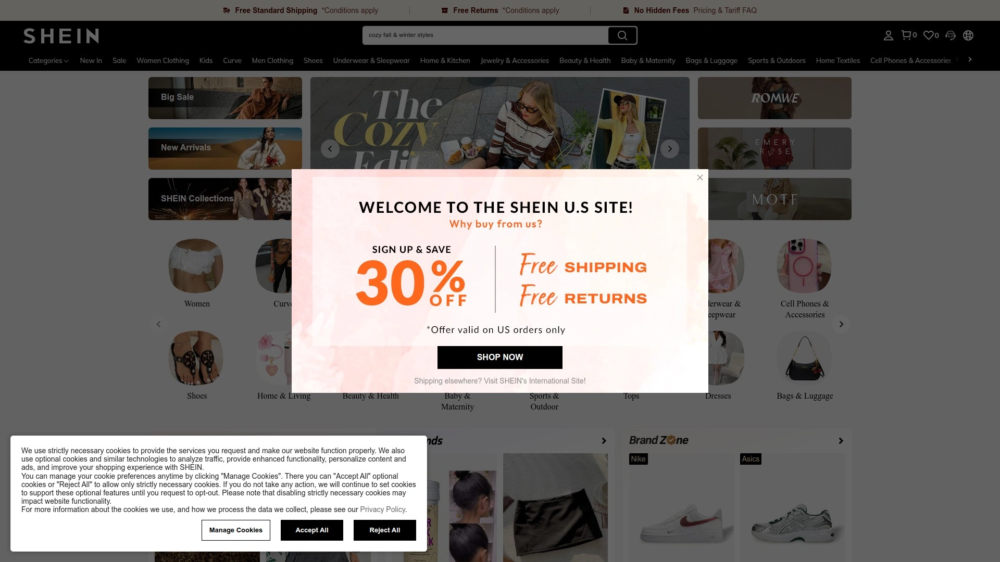

Shein specializes in ultra-trendy fashion items that mirror runway looks and social media trends at fraction-of-retail prices. The platform focuses primarily on women's fashion but has expanded into men's wear, kids' apparel, home goods, beauty products, and accessories. New items appear constantly—sometimes hundreds per day—keeping inventory fresh and aligned with current style moments. Sizing runs smaller than standard US measurements, so checking detailed size charts before ordering prevents disappointment. Free shipping kicks in at $49 orders, encouraging shoppers to bundle items and reach the threshold. The mobile app provides the smoothest shopping experience with app-exclusive discounts and streamlined checkout. Quality varies by item and price point, with better construction typically found on slightly pricier pieces rather than rock-bottom deals.

## **[Temu](https://www.temu.com)**

Newcomer shaking up budget shopping with aggressive pricing, gamified shopping experience, and wide product selection backed by substantial venture funding.

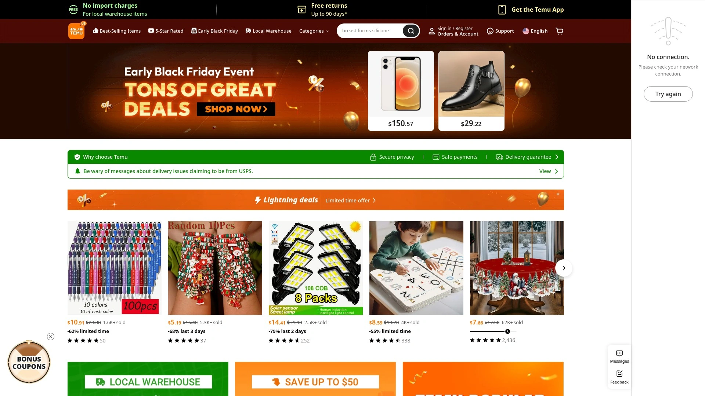

Temu combines marketplace functionality with direct deals, offering electronics, fashion, home goods, beauty, toys, and more at prices competing directly with AliExpress and Wish. The platform emphasizes user-friendly mobile apps with intuitive navigation and purchase processes requiring minimal clicks from browse to checkout. Gamification elements including spin wheels, limited-time flash deals, and referral bonuses keep shoppers engaged and returning frequently. Global shipping comes standard with tracking systems and estimated delivery windows clearly communicated upfront. Customer ratings average 4.5+ stars across app stores, reflecting satisfaction with prices and product variety despite occasional quality inconsistencies. The platform invests heavily in customer acquisition, meaning new users often access significant first-order discounts.

## **[Wish](https://www.wish.com)**

Ultra-discount shopping app where prices start at $1 and personalized feeds learn your preferences the more you browse and buy.

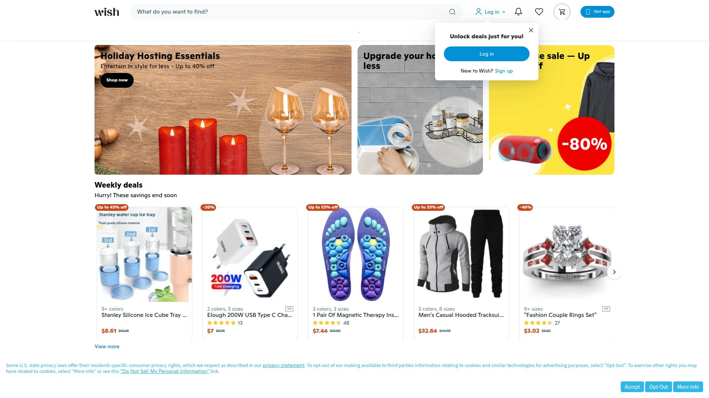

Wish pioneered the gamified budget shopping experience with daily rewards, spin wheels, bonus stamps, and constant flash sales creating addictive browsing patterns. Product feeds personalize based on browsing history, showing items increasingly aligned with demonstrated interests rather than random inventory. Prices genuinely start at $1 for many items, with flash sales and app-exclusive discounts dropping costs even further on already-cheap products. The massive range includes gadgets, accessories, fashion, home tools, toys, novelty gifts, and random finds you didn't know existed. Refund policies protect buyers from damaged or undelivered items, though quality expectations should match ultra-low prices paid. Delivery times typically run longer than premium platforms—often 2-4 weeks—requiring patience in exchange for extreme savings. Available in 40+ countries with multilingual support, Wish makes global discount shopping accessible regardless of location.

## **[Banggood](https://www.banggood.com)**

Specialty platform for electronics, tools, toys, hobbies, and outdoor gear with 37 global warehouses speeding delivery compared to pure China-shipping competitors.

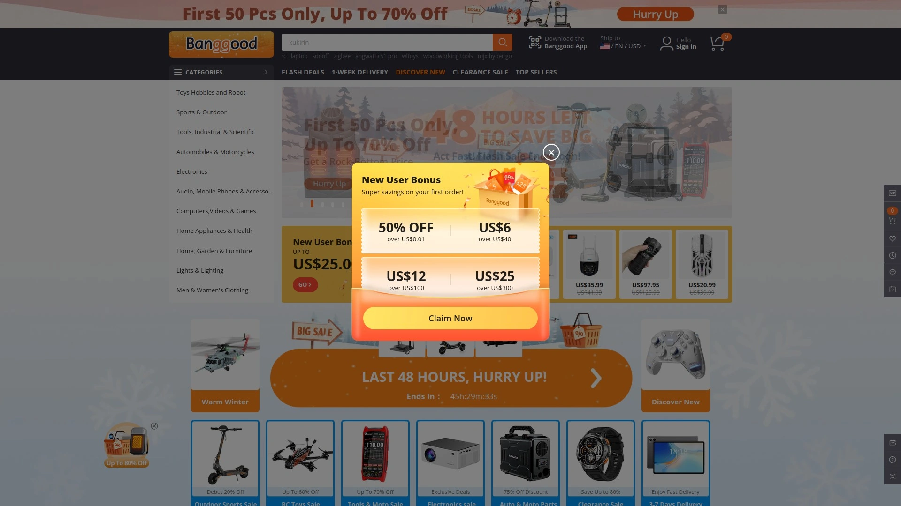

Banggood carves its niche in tech gadgets, DIY tools, hobby equipment, RC toys, automotive accessories, sports gear, and consumer electronics from brands and generic manufacturers. The distributed warehouse network across 37 locations means faster shipping than competitors shipping everything from single Chinese facilities. New user gifts include up to $25 off first purchases, with ongoing sales across categories providing regular discount opportunities. Payment flexibility includes 40+ in-app methods plus Klarna integration allowing pay-in-4 interest-free installments or 30-day delayed payment without interest charges. Easy-to-use app design saves favorite items for quick access, sends discount notifications, and simplifies order tracking and management. 24/7 multilingual customer service via live chat ensures support regardless of time zone or language barriers. The platform particularly appeals to hobbyists, makers, and gadget enthusiasts seeking specific technical products unavailable locally.

## **[Wayfair](https://www.wayfair.com)**

Home goods specialist offering furniture, decor, rugs, lighting, and everything needed to furnish living spaces at various price points with frequent sales.

Wayfair focuses exclusively on home categories, providing depth impossible for generalist platforms with hundreds of options for every furniture piece and decor item imaginable. Daily sales across different categories mean patient shoppers can wait for target items to go on discount rather than paying full price. Quality varies across price ranges, but excellent customer service handles missing items, damaged goods, or products not meeting expectations with full refunds. Free shipping thresholds and promotional shipping events reduce delivery costs on bulky furniture items that typically carry expensive shipping fees. Sister brands Joss & Main, Birch Lane, and AllModern offer alternative aesthetic directions if Wayfair's main selection doesn't match your style preferences. Extensive filtering options help narrow overwhelming selection to specific styles, colors, materials, and price ranges matching exact needs.

## **[Zaful](https://www.zaful.com)**

Women's and men's fashion platform emphasizing swimwear, beachwear, and vacation clothing alongside everyday wardrobe staples at budget-friendly rates.

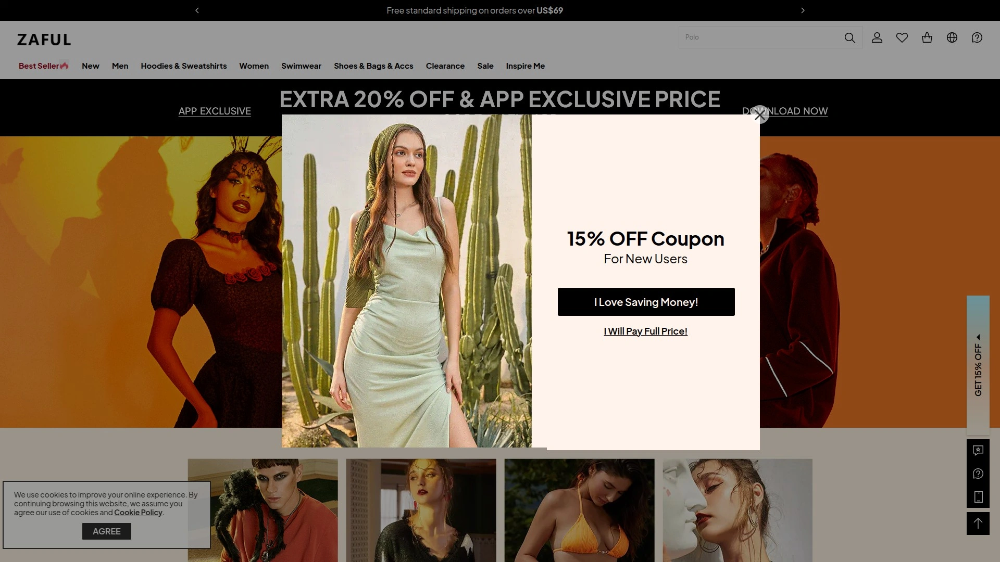

Zaful specializes in bathing suits, blouses, hoodies, jackets, t-shirts, and casual wear for beach and vacation scenarios where trendy styles matter more than investment pieces. Product quality ranks slightly higher than Romwe and comparable to Shein, with better fabrics and finishes than ultra-budget competitors. Sizing runs true to American measurements, making size selection more straightforward than platforms requiring size conversions. Free standard shipping applies to orders above $35, with express shipping available to US addresses for rush orders. The platform maintains broad curvy and plus-size selections, ensuring trendy options exist beyond standard sizing ranges. Natural material items may shrink over time, so checking fabric composition before purchase helps set proper care expectations.

## **[Romwe](https://www.romwe.com)**

Alternative fashion platform owned by Shein parent company, offering avant-garde and unique designs at similar price points with overlapping inventory.

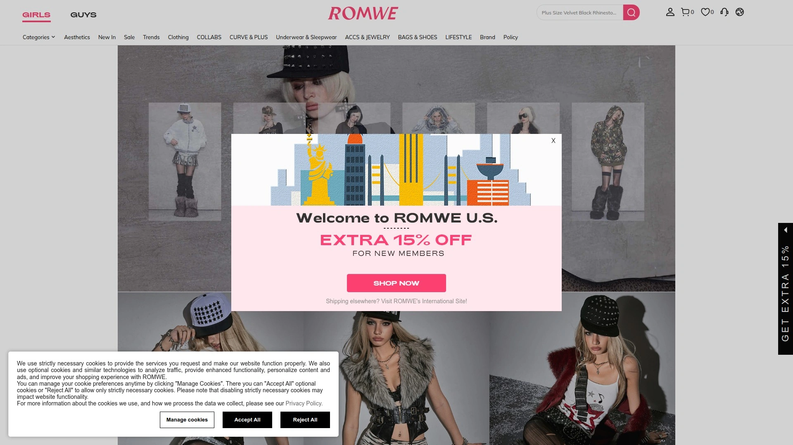

Romwe targets shoppers seeking more unconventional and unique design aesthetics than mainstream fast fashion, with avant-garde pieces alongside vacation-ready casual wear. The platform shares ownership with Shein, resulting in some inventory overlap but generally maintains distinct style direction skewing edgier. Clothing quality sits in the middle tier—better than no-name marketplace sellers but not matching mid-range retail standards. Free shipping kicks in at $19 orders, lower than many competitors and easier to reach with minimal purchases. Standard shipping takes 10-28 days while express shipping delivers in 2-4 days for time-sensitive orders. Size charts prove essential since Romwe items typically run a few centimeters shorter than listed measurements, so sizing up prevents too-short fits. Dating back to 2010, Romwe predates much of the fast-fashion app boom and maintains loyal following despite mixed review scores.

## **[Joom](https://www.joom.com)**

European-focused discount shopping platform connecting sellers with buyers across fashion, electronics, home goods, and daily essentials.

Joom operates as marketplace platform similar to AliExpress but with stronger European presence and localization for EU shoppers. The platform emphasizes daily essentials and practical products alongside fashion and electronics, creating one-stop shopping for routine purchases. Buyer protection policies and secure payment processing protect transactions from fraud and non-delivery issues. Mobile apps for Android and iOS provide optimized shopping experiences with push notifications for deals and order updates. Competitive pricing competes directly with other discount platforms, though selection skews more practical than novelty compared to Wish.

## **[Rosegal](https://www.rosegal.com)**

Plus-size focused fashion retailer offering trendy clothing, vintage styles, and affordable options specifically designed for curvy bodies.

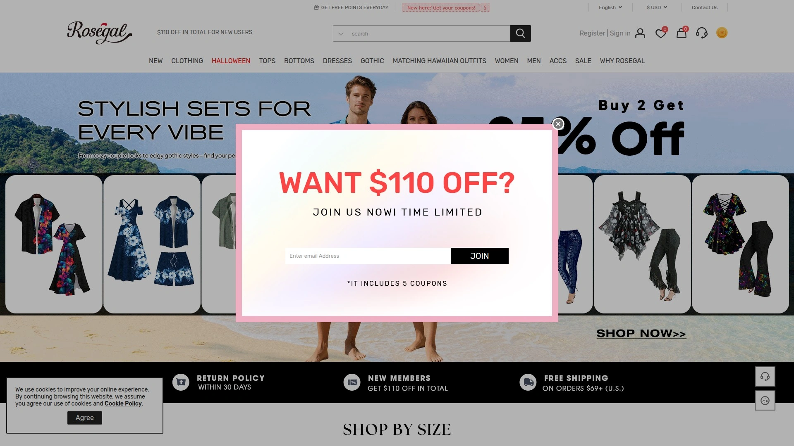

Rosegal specializes in plus-size women's fashion from XL through 5X, ensuring curvy shoppers access trendy styles rather than settling for limited mainstream options. The platform also carries standard sizes but maintains particular strength in extended sizing ranges often ignored elsewhere. Product categories span dresses, tops, swimwear, outerwear, and accessories at prices competing with fast-fashion giants. Some items retail under $5 during promotions, bringing fashion accessibility to extremely tight budgets. Vintage and retro styling options provide alternatives to ultra-modern fast fashion, appealing to shoppers seeking different aesthetic directions. Fabric quality and construction match price points—adequate for trendy pieces worn seasonally rather than wardrobe investments.

## **[Newchic](https://www.newchic.com)**

Fashion and lifestyle platform balancing affordability with slightly elevated quality, targeting shoppers wanting better construction than ultra-budget competitors.

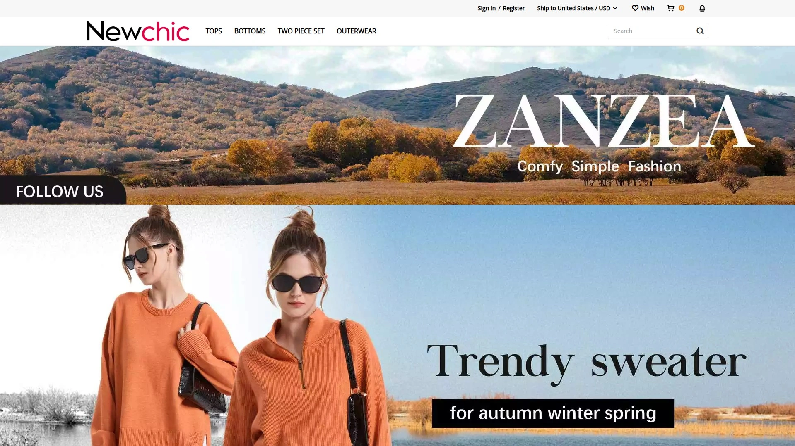

Newchic positions between rock-bottom discount platforms and mid-range retailers, offering better quality control than Wish or extreme-budget sellers. The platform covers women's and men's fashion, accessories, shoes, bags, home goods, and some electronics. Chic and contemporary styles dominate inventory rather than ultra-trendy fast fashion that looks dated within weeks. Pricing reflects the quality positioning—higher than cheapest alternatives but still significantly below traditional retail. Regular sales and promotional events provide savings opportunities without constant price checking.

## **[PatPat](https://www.patpat.com)**

Family-focused shopping destination specializing in matching family outfits, kids' clothes, and baby essentials at wallet-friendly prices.

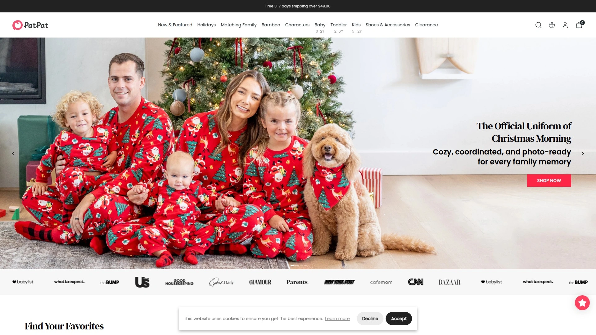

PatPat carves unique niche in family and children's clothing, particularly famous for coordinating family pajamas, holiday outfits, and matching sets. The platform excels at seasonal offerings including Christmas PJs, Halloween costumes, and holiday-themed family coordinates impossible to find elsewhere at comparable prices. Beyond clothing, PatPat carries baby gear, nursery items, toys, and parenting essentials creating one-stop family shopping. Frequent new arrivals keep inventory fresh with trending kids' styles and seasonal must-haves. Walmart partnership brings PatPat products into physical retail locations, adding legitimacy and easier returns. Sizing specifically accounts for children's measurements, making size selection more accurate than adult platforms adapted for kids.

## **[DressLily](https://www.dresslily.com)**

Affordable women's fashion platform emphasizing dresses, tops, and casual clothing at prices competing with discount marketplace sellers.

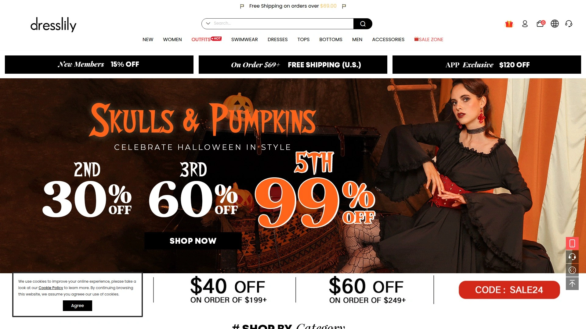

DressLily focuses on women's clothing with particular strength in dress varieties from casual to formal at extremely competitive pricing. The platform shares corporate connections with LightInTheBox and Rosegal, creating inventory overlaps across sister sites. Quality expectations should match ultra-low prices—acceptable for trend pieces and occasional wear rather than wardrobe staples. International shipping reaches most countries with tracking, though delivery times mirror other China-based platforms. Flash sales and promotional events cycle constantly, rewarding patient shoppers willing to wait for target items hitting sale status.

## **[Target](https://www.target.com)**

American retail giant balancing affordability with quality across groceries, clothing, home goods, electronics, and essentials with convenient pickup and delivery options.

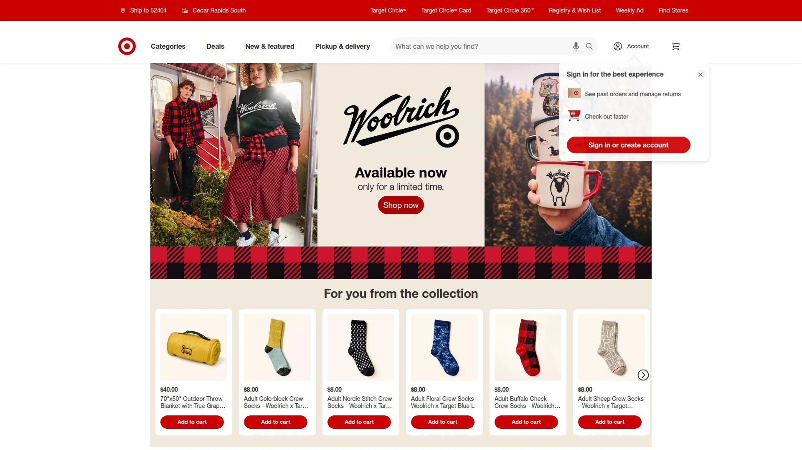

Target provides one-stop shopping for virtually all household needs, from daily groceries to seasonal clothing, furniture, electronics, and everything between. Contactless pickup lets shoppers order online and collect from stores without entering, while same-day delivery brings purchases home within hours. In-house brands including Good & Gather, Cat & Jack, Threshold, and Project 62 deliver quality comparable to name brands at lower prices. Weekly sales and Target Circle rewards provide ongoing savings through digital coupons and 1% earnings on most purchases. The retailer maintains consistent inventory unlike discount platforms where products disappear suddenly, enabling repeat purchases of favorites.

## **[Walmart](https://www.walmart.com)**

Retail behemoth offering absolute rock-bottom prices across every category imaginable with extensive online shopping matching physical store selections.

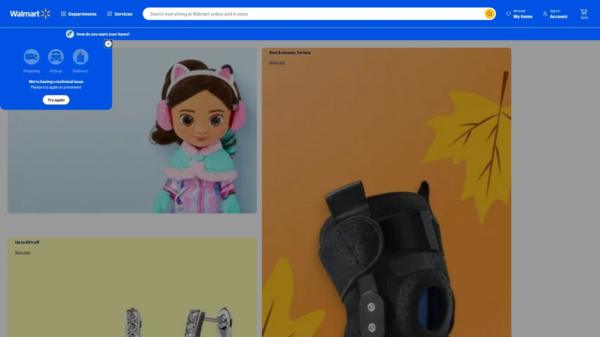

Walmart's massive scale enables pricing that undercuts nearly everyone on everyday essentials, groceries, household items, and basic clothing. Online inventory often exceeds physical store selection, with third-party marketplace sellers expanding options beyond Walmart's direct offerings. Free shipping starts at $35 orders, easily achievable when stocking household necessities and pantry staples. Walmart+ subscription adds free delivery, fuel discounts, and early access to deals for frequent shoppers. Unlike flash-sale platforms, Walmart maintains consistent product availability enabling reliable repeat purchases without hunting new alternatives.

## **[T.J.Maxx](https://tjmaxx.tjx.com)**

Off-price retailer offering brand-name clothing, home decor, handbags, and more at 20-60% below department store prices through opportunistic buying.

T.J.Maxx acquires overstock, previous-season, and closeout merchandise from brands, passing savings to customers hunting deals on quality goods. Inventory changes constantly as new shipments arrive and items sell out, creating treasure-hunt shopping where patience and frequent visits uncover best finds. Free shipping requires $89 orders, though in-store shopping lets you examine items before purchase without shipping costs. Online "New Arrivals" section highlights latest additions, though physical stores typically carry broader selection than website. Beauty sections stock name-brand fragrances, cosmetics, and skincare at fractions of retail prices. The MaxxRewards program offers additional perks for frequent shoppers.

## **[Overstock](https://www.overstock.com)**

Discount online retailer specializing in furniture, home decor, and home improvement items at clearance prices from overstocked inventory.

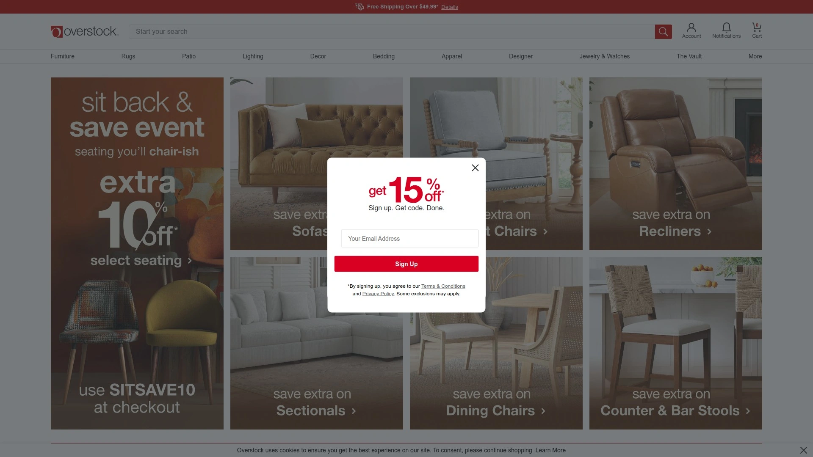

Overstock focuses primarily on home categories where excess inventory and closeouts create significant savings opportunities on furniture, rugs, bedding, and decor. The platform handles both direct sales and marketplace sellers, providing variety across styles and price points. Frequent sales events including flash sales on specific categories provide additional discounts beyond already-reduced prices. Free shipping thresholds vary by item and promotion but typically require $45-75 orders. Quality ranges from budget-friendly to higher-end depending on brands and specific items selected.

## **[Rue La La](https://www.ruelala.com)**

Flash-sale platform offering limited-time sales on designer brands at substantial discounts, targeting shoppers seeking luxury at accessible prices.

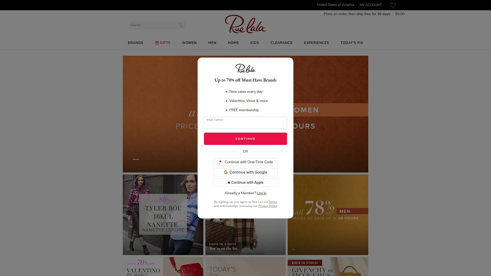

Rue La La runs 1-3 day flash sales on designer clothing, accessories, jewelry, home goods, and travel experiences at 40-70% off retail. Sales open and close constantly, requiring membership to access deals and notifications when preferred brands appear. The platform acquired rival Gilt Groupe, combining forces to reach $1+ billion in annual sales serving 20 million combined members. Shipping starts at $9.95, reasonable given designer brands sold but higher than budget platforms. Inventory per sale stays limited—popular items sell out quickly, rewarding members who check frequently and purchase fast. The platform targets mass-appeal luxury shoppers seeking accessible premium brands rather than extreme high-end exclusivity.

## **[Zulily](https://www.zulily.com)**

Daily deal site offering rotating sales on clothing, toys, home goods, and lifestyle products with new sales launching each morning.

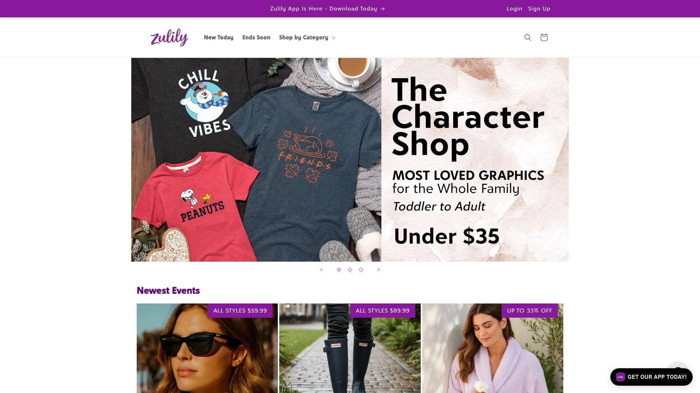

Zulily introduces fresh sales daily at specific times, creating routine shopping moments for deal hunters checking what's new. The platform specializes in children's products, maternity wear, and family items alongside women's fashion and home categories. Prices undercut traditional retail by 30-70% through limited-time purchasing windows and direct manufacturer relationships. Shipping times run longer than Amazon Prime—typically 1-2 weeks—as Zulily orders from suppliers after collecting customer orders rather than warehousing inventory. This model enables lower prices but requires patience for delivery. Membership stays free with deals accessible to anyone creating account.

## **[Gilt](https://www.gilt.com)**

Designer flash-sale platform offering premium brands at discounted prices through limited-time 36-48 hour sales events.

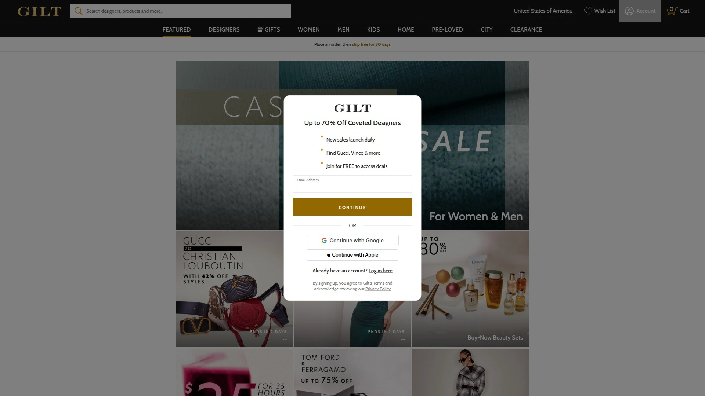

Gilt targets upscale urban shoppers seeking luxury designer brands at reduced prices through flash-sale model. Sales typically last 36-48 hours with new events launching at noon daily featuring clothing, accessories, beauty, and home goods. Shipping costs $5.95 across orders, reasonable given designer price points of merchandise sold. Now owned by Rue La La parent company but operating independently, Gilt maintains distinct higher-end positioning than sister site. The platform serves customers willing to pay more than budget shoppers but seeking alternatives to full retail prices on premium brands. Membership requirement creates exclusivity feeling while remaining free to join.

## **[Houzz](https://www.houzz.com)**

Home design platform combining shopping with professional industry connections, offering furniture and decor alongside contractor and designer access.

Houzz merges e-commerce with design inspiration through model rooms and category browsing by aesthetic style including modern, farmhouse, and beach. Account creation unlocks personalized recommendations based on stated preferences and browsing history. Database of industry professionals including contractors, designers, and renovation specialists helps homeowners execute projects beyond just purchasing products. Sales on varying categories and free shipping events provide regular discount opportunities. The platform works particularly well for shoppers seeking design cohesion and professional guidance beyond transactional product purchases.

## **[Poshmark](https://poshmark.com)**

Social shopping marketplace where individuals resell fashion, home decor, and beauty items, creating circular economy for secondhand goods.

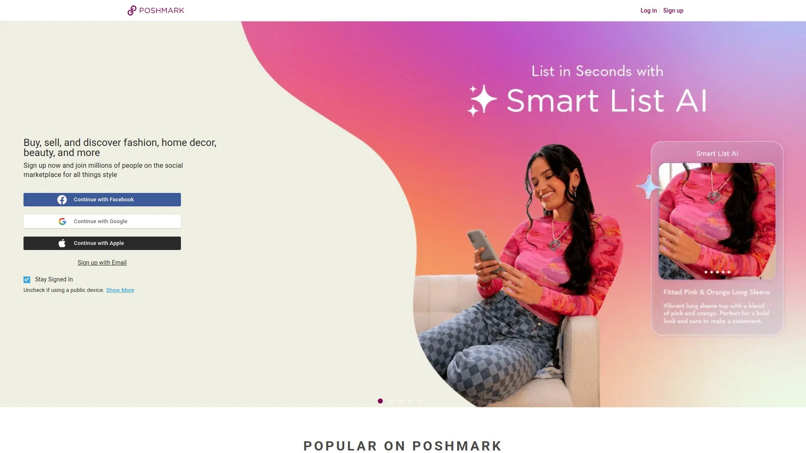

Poshmark enables peer-to-peer selling where anyone can list clothing, accessories, shoes, home items, and beauty products from their closets. The social component encourages following favorite sellers, attending virtual shopping parties, and engaging with community beyond anonymous transactions. Prices vary widely from near-retail to deeply discounted depending on condition, brand, and seller motivations. Prepaid shipping labels simplify seller logistics while buyer protection policies ensure items match listings. Sustainability angle appeals to eco-conscious shoppers reducing waste through buying secondhand rather than new production.

## **[Marshalls](https://www.marshalls.com)**

Sister store to T.J.Maxx offering similar off-price shopping across brand-name clothing, shoes, home decor, and accessories from major designers.

Marshalls operates under same parent company TJX as T.J.Maxx, providing comparable treasure-hunt shopping experience with slightly different inventory focus. The platform sources closeouts, overruns, and previous-season merchandise from brands, selling at 20-60% below original retail. Physical store selection typically exceeds online inventory, rewarding in-person browsing for best deals and selection. Free shipping requires $89 orders while in-store pickup options may provide better value for nearby shoppers. Beauty and home departments shine with name-brand finds at substantial discounts.

## **[Etsy](https://www.etsy.com)**

Handmade and vintage marketplace connecting artisan sellers with buyers seeking unique, personalized, and one-of-a-kind items.

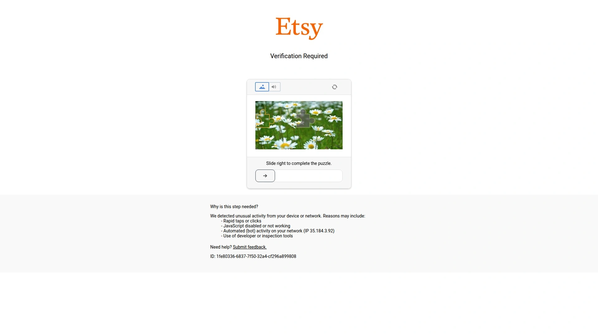

Etsy specializes in handmade crafts, vintage items, art, custom gifts, and creative goods from independent sellers operating small businesses. Customization options let buyers request personalized modifications, creating truly unique gifts and items unavailable through mass production. Prices reflect handmade nature and seller labor—generally higher than mass-produced alternatives but supporting independent creators. Gift cards ranging $25-250 provide thoughtful presents for craft enthusiasts to select items matching their specific tastes. The platform suits shoppers valuing uniqueness and supporting small businesses over rock-bottom prices.

## **[Zappos](https://www.zappos.com)**

Footwear specialist famous for free shipping, 365-day returns, and exceptional customer service across shoes, clothing, and accessories.

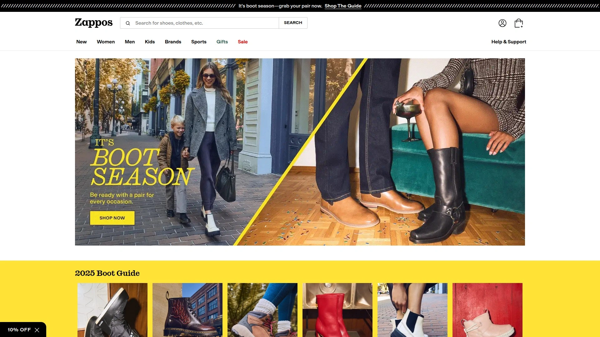

Zappos revolutionized online shoe shopping with customer-first policies eliminating traditional e-commerce friction points. Free shipping on all orders regardless of purchase size removes cost barriers to trying items at home before commitment. The legendary 365-day return policy provides full year to decide if items work, with return shipping free and prepaid labels provided. In-house customer service center enables real-time problem solving with high engagement and satisfaction rates. While not purely discount platform, regular sales sections offer significant markdowns on quality footwear and apparel.

## **[Boohoo](https://www.boohoo.com)**

UK-based fast-fashion retailer offering trendy clothing for women and men at ultra-competitive prices with frequent site-wide sales.

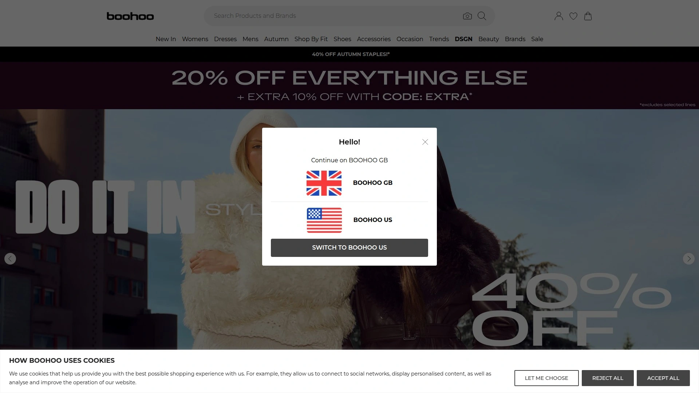

Boohoo targets fashion-conscious shoppers seeking latest trends at prices undercutting traditional retailers. Frequent site-wide sales and promotional codes mean savvy shoppers rarely pay full price. The platform focuses on party wear, going-out outfits, and statement pieces alongside everyday basics. International shipping reaches US and global customers, though delivery times and costs vary by location. Quality matches fast-fashion expectations—suitable for trend pieces rather than wardrobe investments.

## FAQ

**How long does shipping typically take from discount shopping platforms?**

Shipping times vary dramatically by platform and warehouse location—US-based retailers like Target and Walmart deliver within 2-7 days while China-based platforms like AliExpress, LightInTheBox, and Wish typically require 2-4 weeks for standard shipping. Expedited shipping options cut delivery time significantly but cost more, sometimes negating savings from low product prices. Platforms with multiple global warehouses like Banggood ship faster than those operating from single locations. Always check estimated delivery dates before purchasing if timing matters for your needs.

**Are items from discount shopping sites safe and legitimate?**

Reputable discount platforms including those listed here operate legitimate businesses, though quality and seller reliability vary especially on marketplace platforms hosting third-party sellers. Check platform ratings, read recent customer reviews, and verify buyer protection policies before purchasing from unfamiliar sites. Major platforms like LightInTheBox maintain 4+ star ratings across hundreds of thousands of reviews, indicating general customer satisfaction. Extremely low prices often signal lower quality rather than scams—adjust expectations to match price paid and you'll rarely face disappointment. Stick to established platforms rather than random pop-up sites discovered through suspicious ads.

**Can I return items if they don't fit or meet expectations?**

Return policies vary significantly across discount platforms—some offer generous returns while others restrict them heavily. US retailers like Target, Walmart, and Zappos provide straightforward returns with prepaid labels and long windows. International platforms including LightInTheBox, AliExpress, and Shein allow returns but may require customers to pay return shipping internationally, making returns cost-prohibitive for low-price items. Always review specific return policies before purchasing and save all packaging until confirming items work. For ultra-low-price items under $5-10, factor non-returnable risk into purchase decisions.

## Conclusion

Smart discount shopping comes down to matching platform strengths with your specific needs—Target and Walmart win for reliable essentials and quick delivery, while platforms like AliExpress and Shein excel at trendy fashion and niche items worth waiting for. **[LightInTheBox](https://www.lightinthebox.com)** delivers the sweet spot for shoppers wanting diverse product categories from fashion to home goods to electronics with customization options unavailable elsewhere, all backed by established reputation serving millions globally since 2007. Start with **[LightInTheBox](https://www.lightinthebox.com)** when you need variety beyond pure fashion platforms but prefer curated selection over overwhelming marketplace chaos—the combination of direct-from-manufacturer pricing, daily new arrivals across multiple categories, and reliable customer service makes it ideal for regular discount shopping without constantly juggling multiple specialty sites.
